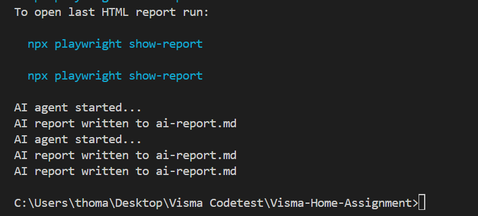
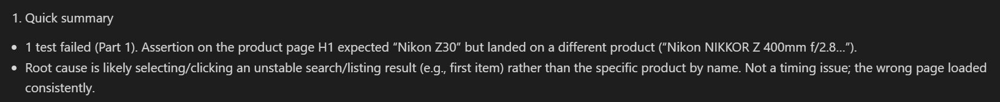
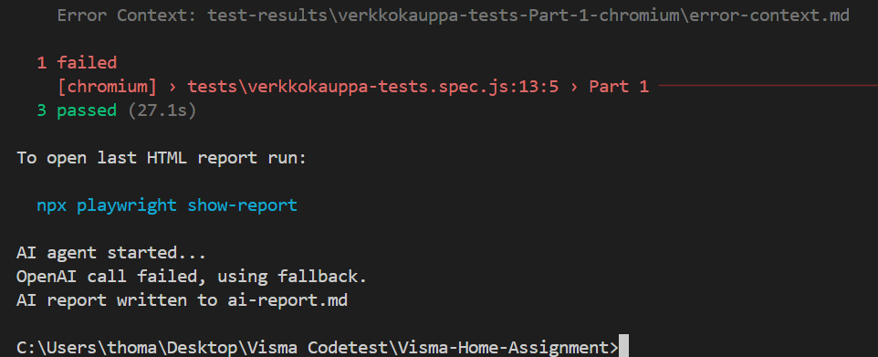
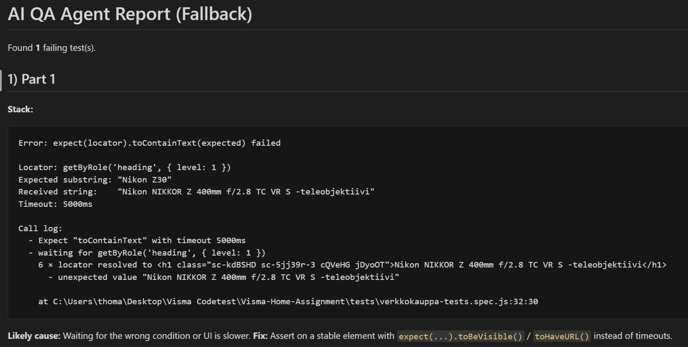

# Visma-Home-Assignment Thomas Segercrantz
## Instructions
### Prerequisites
- Node.js
- npm
### 1. Clone the repository
```posh
git clone https://github.com/ThomasSegercrantz/Visma-Home-Assignment.git
cd Visma-Home-Assignment
```
### 2. Install dependencies
```posh
npm install
```
### 3. Install Playwright browsers
```posh
npx playwright install
```
### 4. Setup environment variables
Create a '.env' file in the root directory. This .env file will contain the OPENAI_API_KEY. You can copy the '.env.example' and rename it to '.env'
### 5. Run tests
To run the test with no ai-agent.
```posh
npx playwright test
```
To run the test with the browser showing.
```posh
npx playwright test --headed
```
To run the tests with the ai-agent.
```posh
npm run test:with-agent
```

Tests are configured to run on Chromium only for simplicity and execution time. Cross-browser support can easily be enabled in playwright.config.js by uncommenting the lines regarding this, if required. To view the report generated by the AI agent, it can be found in 'ai-agent.mjs' in the root of the project.
## Part 1
This test fails. That is due to the fact that the second product selected does not contain "Nikon Z30" at all on the page. So the test works in that sense, it just fails because Verkkokauppa site does not work in the intended way.
## Part 2
The tests I chose all correspond to basic, but highly vital parts of the program that should always and regularly be tested to work, and can be ran autonomously so a manual tester must not do these monotone basic tests at regular intervalls. Since they are basic tests that don't delve to deep into testing many parts of the site at once, they are great for autonomous testing.
### Test 1
The first test checks the functionality of buying a product. It starts by searching for a product, adding it to the cart, then proceeding as far as possible in the shopping experience until logging in is necessary. This is a vital customer experience and very important for an e-commerce site to ensure that always works. I chose this as I believe it to be highly relevant and something that would always need to be ensured that it works.
### Test 2
The second test checks that filtering functions work. It does this by searching for a product, applying a filter and then checking the filter was applied in three ways: By checking that the amount of results is less, that a button to remove filters appeared, and that filter was applied from the URL. This is a feature that can easily break, and is vital for customer experience, and therefore I chose it for the second test as I found it to be very relevant for the e-commerce site.
### Test 3
The third and final test checks that all the standard and necessary information for a product page has been loaded correctly. It also wired so that it navigates differently to a product, not by searching, but by going through menus and sub-menus, so that part of the site is tested to work as well. After selecting a product much of the vital information is asserted to habe been loaded properly on the page. I chose this test to have a test that always assures that one of the core functionalitys of the site always works, and one that users will do often and repeatedly, vital information for features prone to breaking and repetitive functions. 
## Part 3
So I must admit, as I had virtually no experience prior to this with AI agents, either desiginging, implementing or using one in a project, this part was done with the help of ChatGPT. The AI agent I decided to go for in this project is an error helper, an agent that reads a Playwright JSON report and based on that gives information on what went wrong and gives pointers as to that what could fix the error. This helps us with many pain points, as it summarizes all our errors quickly into one place, and hopefully sets us on the right direction immediately to start solving the problem. 

It works by parsing the test results from the report.json file, collects the failing results, and extracts the error messages and stack traces. It then creates a compact JSON summary that is sent to OpenAI, constructing a prompt to summarize failures, suggest proabble causes and give Playwright specific recommendations. It then creates a "ai-report.md" markdown file with the AI response. In case the OpenAI call fails, due to an error, lack of token funding or other reason, there is a fallback heuristicReport function that creates a rule-based assumption of the error into the markdown file. 



The AI agent is called at the end of a test run, here we have the OpenAI API working as intended.



The summary generated by the AI, full AI answer can be found at "ai-report.md" at the root of the project.



The AI agent is called but the OpenAI call fails, reverting to the heuristicReport instead.



The error summary generated by the heuristicReport, in case of OpenAI failure.